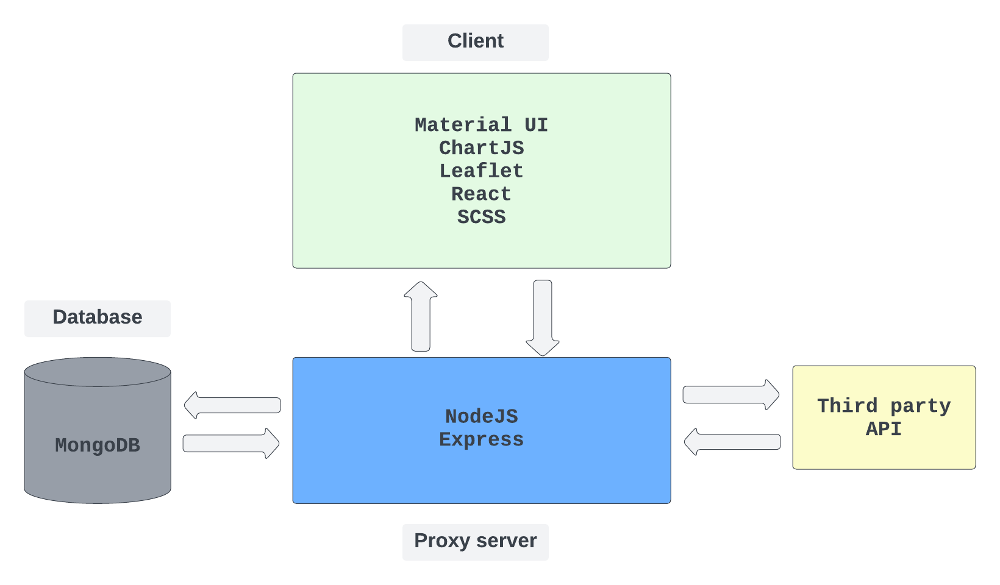

## Architecture

- This application serves as a middleman between **the client, the database, and an external API**. It utilizes a proxy server built with NodeJS/Express to handle incoming requests and perform necessary calculations.
- The proxy server is responsible for handling requests from the client and ensuring that the appropriate calculations are performed in the database or server-side. This approach minimizes the amount of data transformation required on the client side.

- In addition, the application integrates with the Digitransit API to perform three tasks:
  - **Name search**: search locations streets, etc. when users perform station name search.
  - **Route calculation**: act as a helper to calculate duration and distance when users perform journeys creation.
  - **Reverse geocoding search**: act as a helper to reverse search while users pinpoint the location on Map.
- During the stage of cleaning and importing data to MongoDB, the application also initiates two small, self-closing servers to perform deduplication and import. This approach streamlines the data import process and ensures that the data is accurate and free of duplicates.

