## Features

### Data import

#### Recommended

- [x] Import data from the CSV files to a database or in-memory storage.
- [x] Validate data before importing.
- [x] Don't import journeys that lasted for less than ten seconds.
- [x] Don't import journeys that covered distances shorter than 10 meters.

#### Extras

- [x] Remove duplicated journeys in csv files before importing.
- [x] Count rows, total imported data, total removed and logs to the console with easy-to-spot colors.
- [x] Scripts in package.json to easily handle.
- [x] Scalable if upcomming data (journeys and stations) with same name structure are required to add to database.

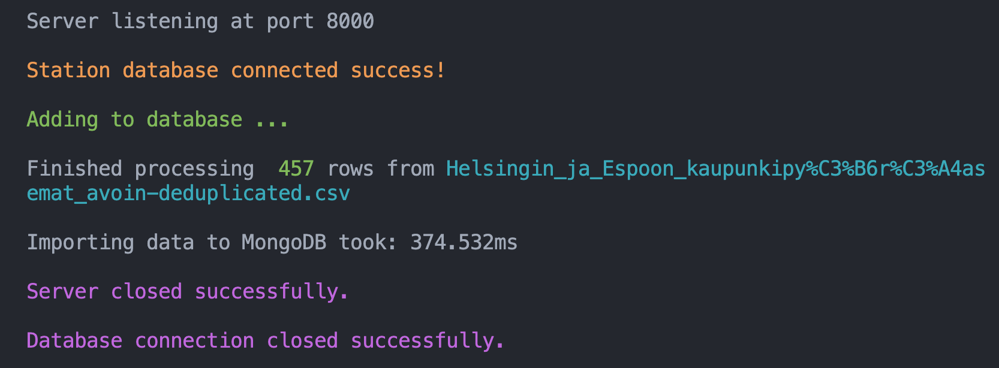
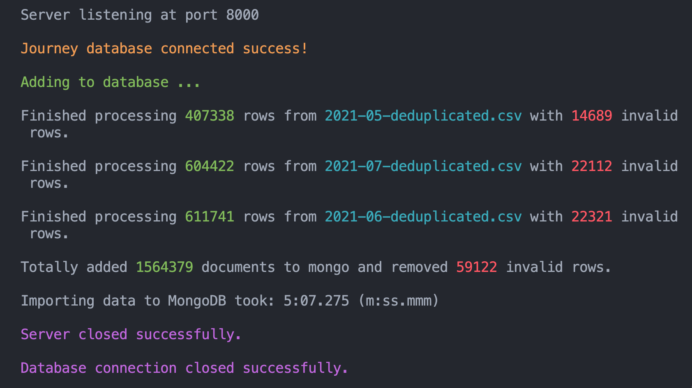

### Journey list view

#### Recommended

- [x] Pagination fetch on backend.
- [x] For each journey show departure and return stations, covered distance in kilometers and duration in minutes.

#### Additional

- [x] Pagination.
- [x] Ordering per column.
- [x] Filtering.

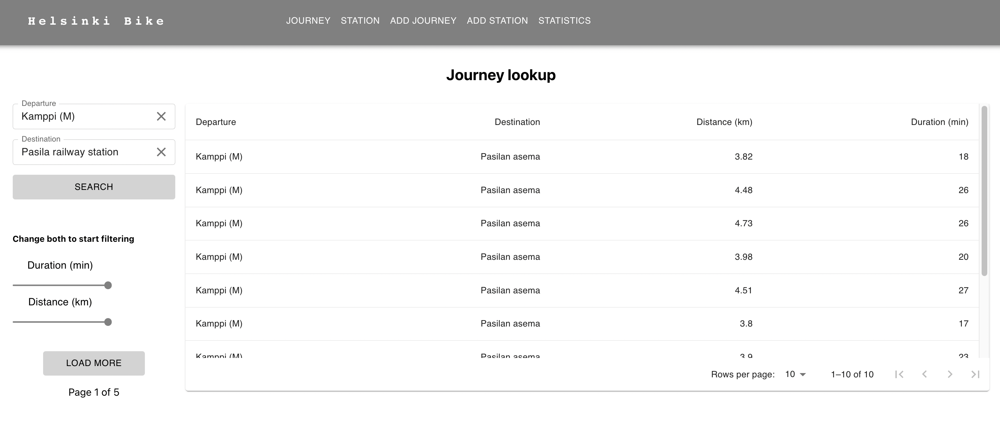

### Station list

#### Recommended

- [x] List all the stations.

#### Additional

- [x] Pagination.
- [x] Searching.

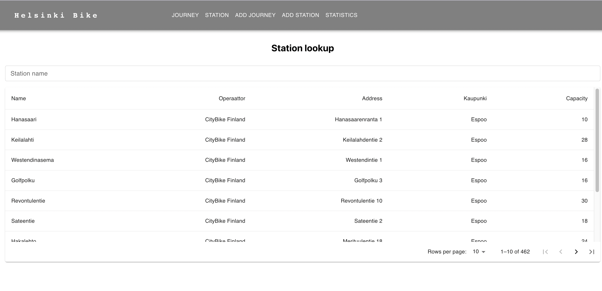

### Single station view

#### Recommended

- [x] Station name.
- [x] Station address.
- [x] Total number of journeys starting from the station.
- [x] Total number of journeys ending at the station.

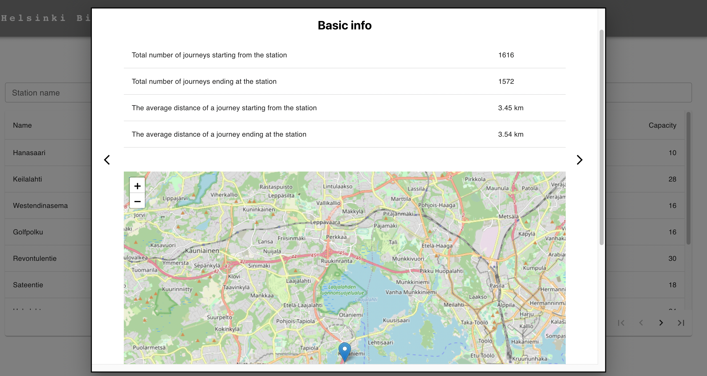

#### Additional

- [x] Station location on the map.
- [x] The average distance of a journey starting from the station.
- [x] The average distance of a journey ending at the station.
- [x] Top 5 most popular return stations for journeys starting from the station.
- [x] Top 5 most popular departure stations for journeys ending at the station.

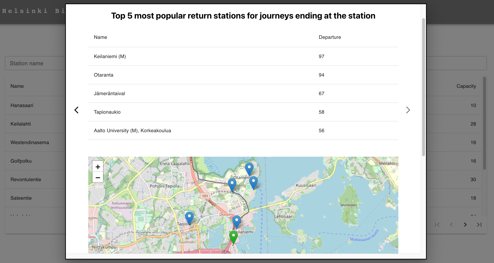

#### Extras

- [x] Apply Modal to save space.
- [x] Distinguish root and edge locations.

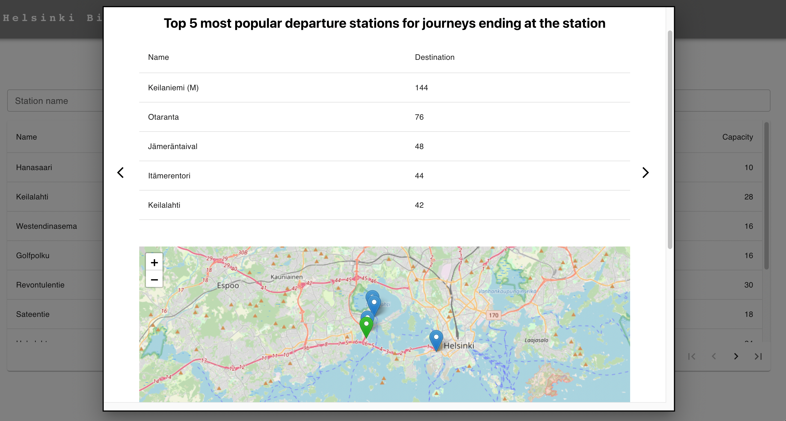

### Add Journey

#### Recommended

- [x] Create UI for adding journeys.

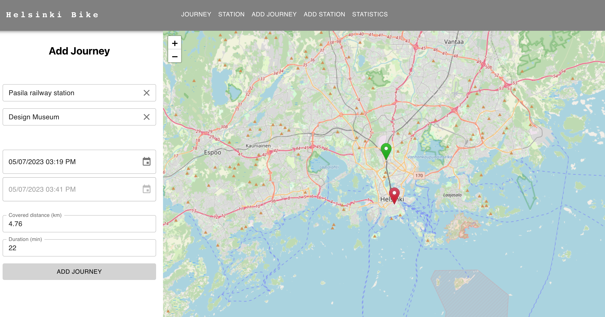

#### Extra

- [x] Auto calculate distance and duration using HSL Digitransit API and locate positions in map.
- [x] Display notification to users when create journey successfully or error when user entering same locations.

### Add Station

#### Recommended

- [x] Create UI for adding stations.

#### Extra

- [x] Name searching, geocoding searching (while moving location point), using Digitransit API.
- [x] Station dup existence checking.

### Statistics

#### Recommended

- [x] Ability to filter all the calculations per month

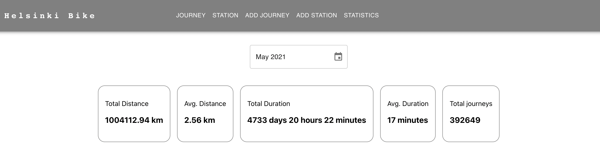

#### Extra

- [x] Database filtering and searching using Mongo aggregate.
- [x] Display data to chart to visualize top stations and routes

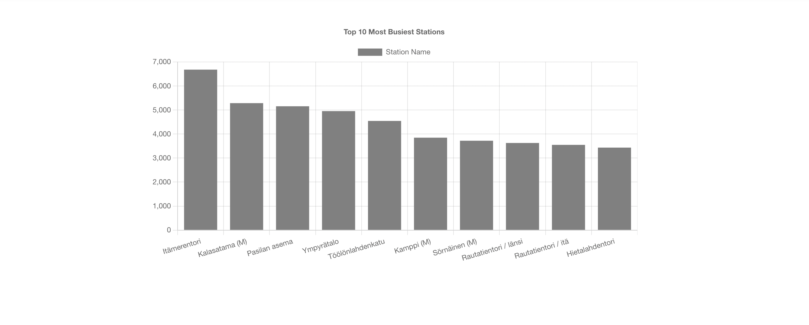

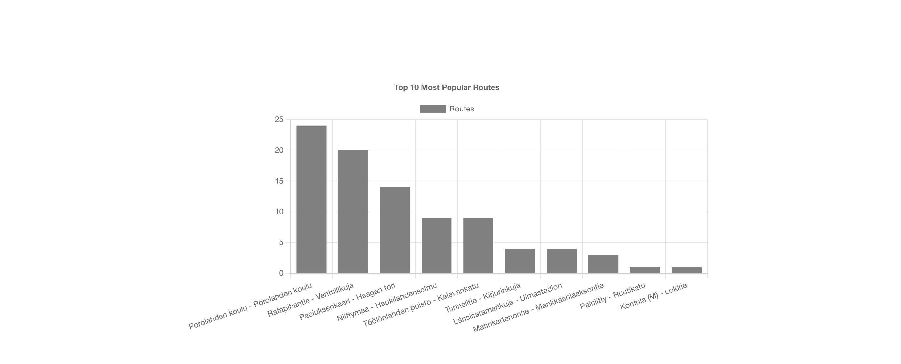

### Surprising parts

- [x] Endpoints to store new journeys data or new bicycle stations
- [x] Running backend in Cloud - Heroku
