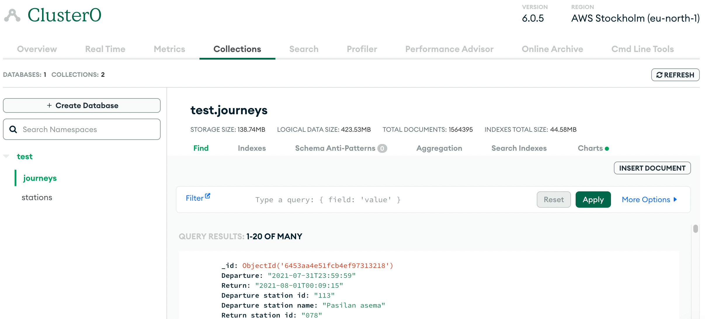

### Local setup

### Installation

#### Prerequisites

```
 "engines": {
    "node": ">=18",
    "npm": ">=8"
  },
```

1. Clone this repository to your local machine using

```
git clone https://github.com/UlrichDinh168/dev-academy-Solita.git
```

2. Navigate to the project directory using `cd dev-academy-Solita`.
3. Install the dependencies using `npm install` or `yarn`.

### Download the requirements

1. Download these datasets of the journey and move the downloaded csv files into `./src/lib/csv` folder.

   - <https://dev.hsl.fi/citybikes/od-trips-2021/2021-05.csv>
   - <https://dev.hsl.fi/citybikes/od-trips-2021/2021-06.csv>
   - <https://dev.hsl.fi/citybikes/od-trips-2021/2021-07.csv>

2. Also, download the dataset that has information about Helsinki Region Transport’s (HSL) city bicycle stations and add them to `csv` folder.

   - Dataset: <https://opendata.arcgis.com/datasets/726277c507ef4914b0aec3cbcfcbfafc_0.csv>

### Local setup

1. Create an account in MongoDB and acquire the database URL string.

   - [Instruction](https://www.mongodb.com/docs/atlas/tutorial/connect-to-your-cluster/).

   - MongoDB string is in this format: `"mongodb+srv://<username>:<password>@clustername.mongodb.net/test?retryWrites=true&w=majority&useNewUrlParser=true&useUnifiedTopology=true"`
   - The default database name is **test**

2. Create [Digitransit](https://portal-api.digitransit.fi/) account and acquire API_KEY.

   - [Instruction](https://digitransit.fi/en/developers/api-registration/).

3. Create `.env` file and add `DATABASE_URL` (Remember to add the password by replacing whole phrase including `<passowrd>`) and `DIGITRANSIT_KEY`.

   - Refering the `.env.example` to setup the environment variables.

4. In the root folder, run the following scripts in order:

   - Run `npm run dedup` to remove all the dupped lines in the files.
   - Run `npm run import` to auto import 'clean' files to database.

5. Verify the import process

   - _The whole importing process should take roughly 5 minutes to complete. You can check the logs in the terminal._
   - _After import process is finished, you can verify it in your collection_



6. Start the development server

   - Open terminal and run `npm run server:dev` to start the development server on `locahost:3001`.
   - Open another terminal and run `npm run client:dev` to start the development client `localhost:3000`.
   - `npm run build` to build the whole project and store in `dist` folder.
   - `npm start` to run the server in production and serve build contents.

### Local build

- Run `npm run build` will build both **client** and **server** folders to the `dist` folder.

### App browsing guild

1. Add Station

   - Click on the "Add Station" button in `Navbar` to navigate to the Add station page.
   - You can search for the station by typing in the search bar, and adjust the location by dragging the point on the map (if you're confident with your navigation skill, you the do it the opposite way as well).
   - _Note that you **cannot** create same station twice._

---

2. Add Journey

   - Click on the "Add Journey" button in `Navbar` to navigate to the Add journey page.
   - Enter the journey details (departure & destination), it will pinpoint in the map 2 of your selected locations.
   - You can also adjust the duration and distance of your routes.
   - _Note that you **cannot** create journeys with same locations._

---

3. Statistics

   - Click on the "Statistics" button in `Navbar` to navigate to the new Statistics page.
   - The top 10 stations and routes will be displayed monthly.
   - It is suggested to add several routes and stations to the desired month for the chart to beautifully display.
