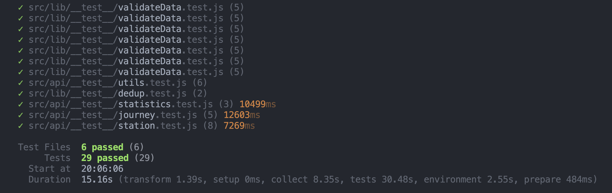
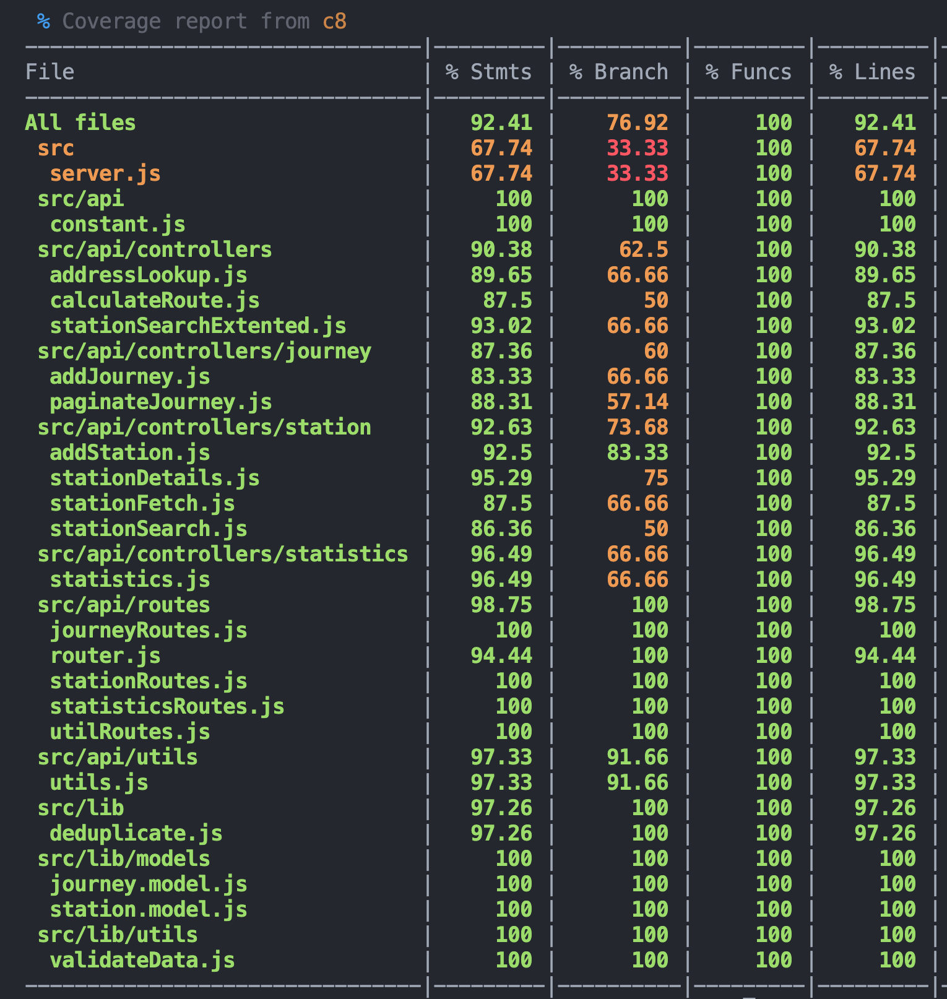
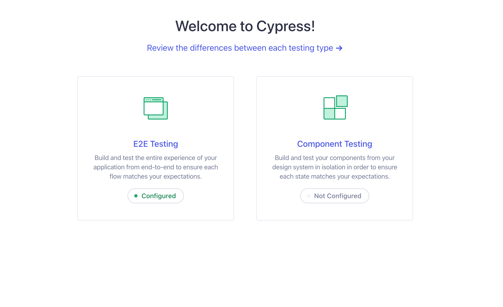
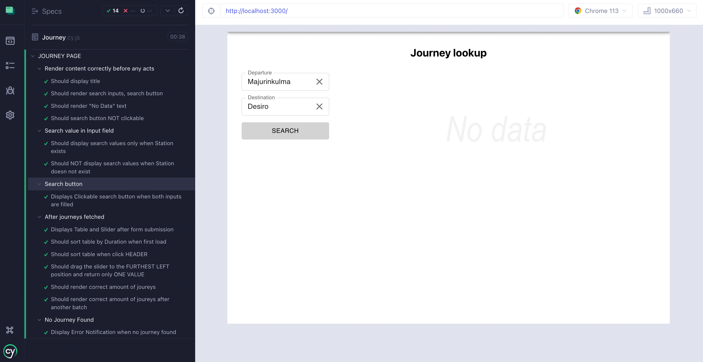

# Testing

- Unit test with Vitest is used in the Backend.
- E2E Test with Cypress is used in the Frontend.

## Unit test in Backend

- Testing function that validate data if it runs correctly.
- Testing deduplication function is correctly remove dupped lines in journey csv files.
- Testing the endpoints of the API return data in correct structure and status code.

### Running the tests

- Open a terminal and run `npm run test` in the root directory.
  
  

## E2E test in Frontend

- Testing simulate user interactions, such as clicking buttons, filling out forms.
- Testing if specific elements, text, or behaviors are shown correctly.

### Running the tests

1. Start the server: `npm run server:dev`
2. Start the client: `npm run client:dev`
3. Run `npm run cypress` in the root directory to start cypress.
4. A window will popup, select `E2E Testing`, it will take you to the Cypress Testing UI.
   

- Cypress Journey test view
  
